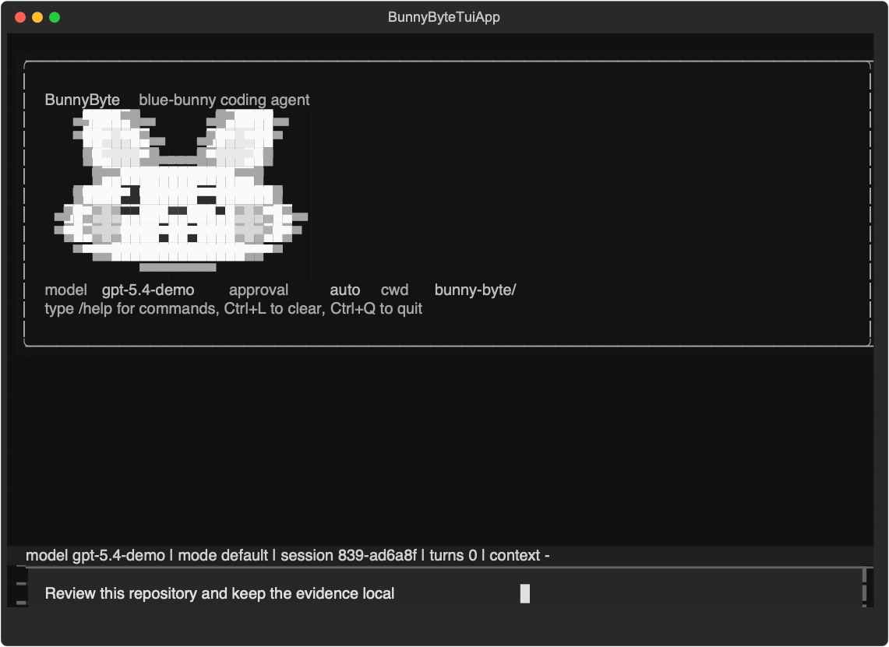
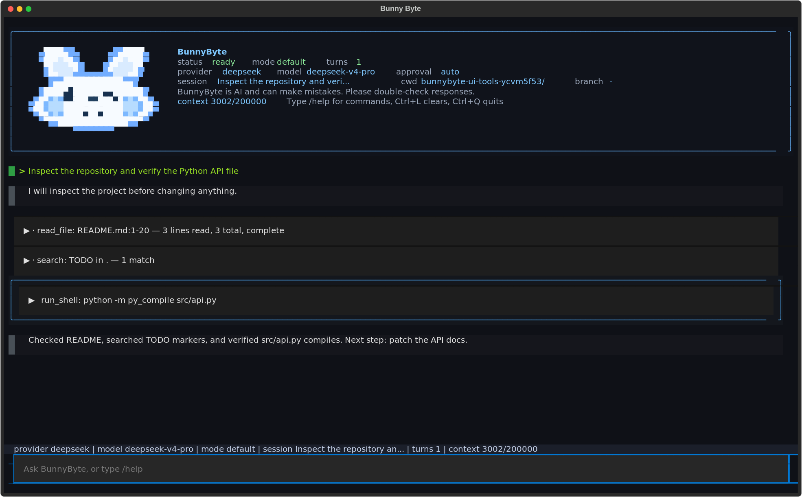
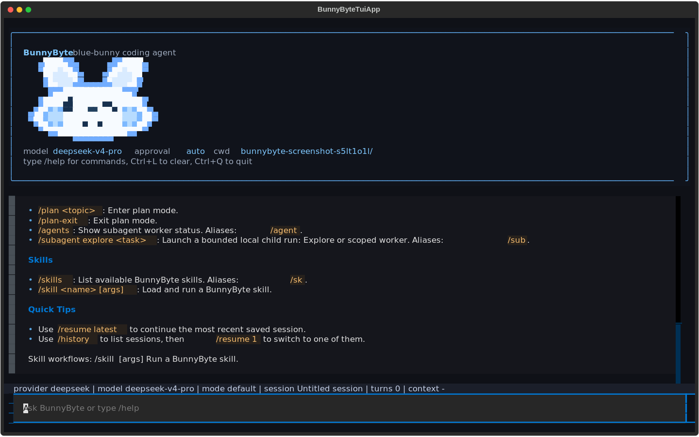
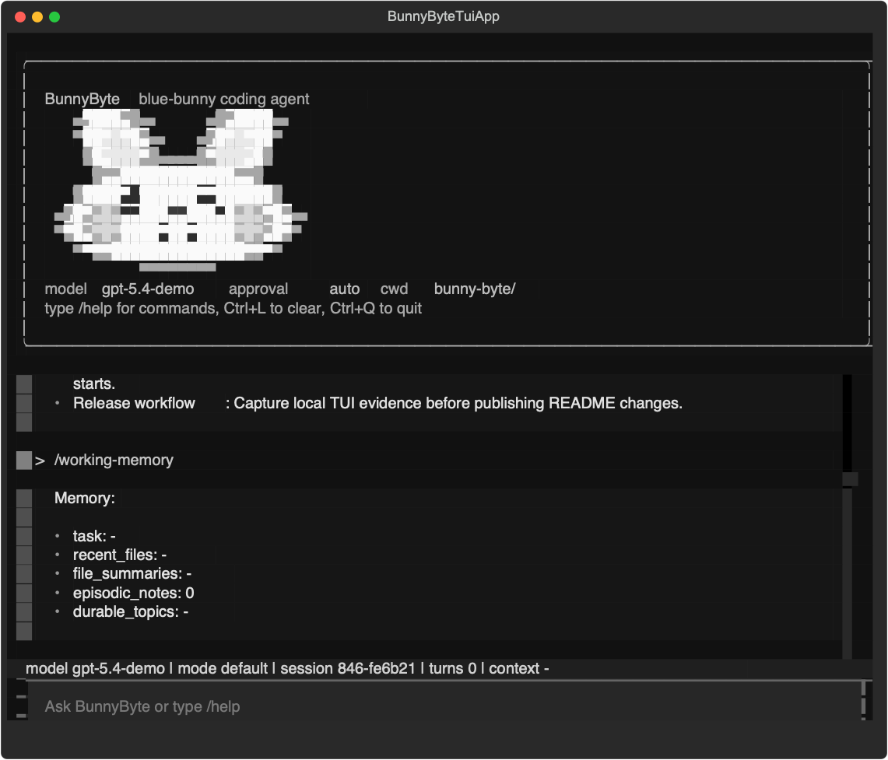
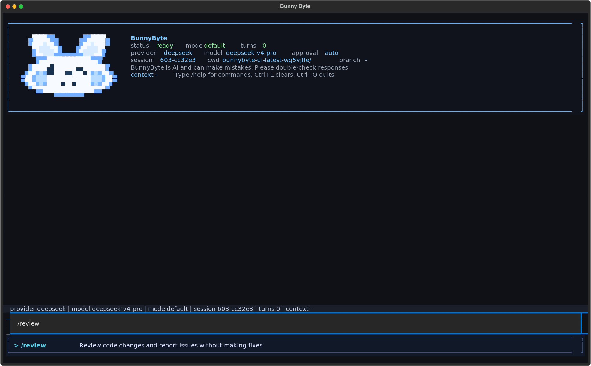

<div align="center">

# Bunny Byte

[中文](README.md) | [English](README.EN.md)

**A local-first, auditable terminal coding agent with memory**

Bunny Byte runs inside your repository, connects to OpenAI-compatible,
Anthropic-compatible, or DeepSeek model providers, and uses controlled tools to
read code, search, run commands, edit files, and keep sessions, event streams,
traces, reports, and long-term memory on your machine.

</div>

<p align="center">
  
</p>

---

## What Is Bunny Byte?

Bunny Byte is a terminal coding agent for local repositories. It does not hand a
model raw shell access. Instead, each run is structured as an observable,
recoverable, and auditable workflow:

- **Provider profiles** choose the model source, while `protocol` controls the
  request format. Bunny Byte supports OpenAI Responses API and
  Anthropic Messages-compatible endpoints.
- **Prompt context** assembles runtime rules, repository context, tools, skills,
  working memory, durable memory, and recent history within a budget.
- **Text protocol tool calls** require the model to emit `<tool>...</tool>` or
  `<final>...</final>`. Local parsing validates tool calls before execution.
- **Tools** include file listing, reading, search, shell, file writing, precise
  patches, todos, `ask_user`, subagents, and plan mode.
- **Approval, sandboxing, and policy** can gate writes, shell commands, and risky
  actions. `run_shell` can use a bubblewrap sandbox when available.
- **Subagents** support read-only exploration and scoped worker tasks without
  mixing their internal sessions into normal history.
- **Run evidence** stores session JSON, event JSONL, run traces, task state,
  reports, and checkpoints.
- **Memory and auto-dream** keep working memory for the current task, daily logs
  for observations, and durable topics for long-term project knowledge.

Bunny Byte aims to be as transparent as a local engineering tool and as useful
as a coding agent that can keep working across sessions.

> BunnyByte is AI and can make mistakes. Please double-check responses.

## Interface

The TUI and the line-based REPL use the same runtime. In the TUI, you can see
model status, tool calls, tool results, worker notifications, slash-command
completion, session progress, and context usage.

<p align="center">
  <strong>Tools and subagents</strong><br>
  
</p>

<p align="center">
  <strong>Skills, help, and command completion</strong><br>
  
</p>

<p align="center">
  <strong>Memory and durable topics</strong><br>
  
</p>

<p align="center">
  <strong>Slash-command workspace</strong><br>
  
</p>

## Install

Requirements: Python 3.10+, git, and at least one model provider key.

### One-Line GitHub Install

```bash
curl -fsSL https://raw.githubusercontent.com/LISAooo1234/Bunny-Byte/main/install.sh | bash
```

The installer clones Bunny Byte into `~/.bunnybyte-agent`, creates an isolated
virtual environment, and writes global launchers into `~/.local/bin`:

```bash
bunny
bunnybyte
```

After installation, you do not need to enter the project directory or run `uv`.
Open any repository and start Bunny Byte directly:

```bash
bunny setup
bunny
```

If your shell cannot find `bunny`, add `~/.local/bin` to `PATH` and restart the
terminal:

```bash
echo 'export PATH="$HOME/.local/bin:$PATH"' >> ~/.zshrc
source ~/.zshrc
```

### pipx Install

If you prefer managing global Python CLIs with `pipx`, install directly from
GitHub:

```bash
pipx install git+https://github.com/LISAooo1234/Bunny-Byte.git
bunny
```

### Source Checkout

```bash
git clone https://github.com/LISAooo1234/Bunny-Byte.git
cd Bunny-Byte
pip install -e ".[dev]"
```

For development with uv:

```bash
uv sync --dev
uv run bunny
```

Available commands after installation:

```bash
bunny          # recommended global command
bunnybyte      # full command name
bb             # short alias
bunnybyte-tui  # start the TUI directly
bbtui          # short TUI alias
```

## Configure A Provider

Bunny Byte resolves a **provider profile** before startup. The profile name
selects a provider configuration; `protocol` decides the HTTP request format.

| Field | Purpose |
| --- | --- |
| `protocol` | Request protocol. Supported values: `openai`, `anthropic`. |
| `api_key` | API key sent to the provider. |
| `base_url` | Provider endpoint. |
| `model` | Model name for the run. |

### Beginner-Friendly Global Setup

After installing, run:

```bash
bunny setup
```

It guides you through choosing a provider, entering an API key, and saving a
global config here:

```text
~/.config/bunnybyte/config.toml
```

You only need to do this once. After that, open any repository and run:

```bash
bunny
```

You can also create the global config non-interactively:

```bash
bunny setup --provider deepseek --api-key sk-...
```

Inspect the current global config:

```bash
bunny config show
bunny config path
```

### Global Config File

`bunny setup` writes a file like this:

```toml
provider = "deepseek"

[providers.deepseek]
protocol = "anthropic"
api_key = "sk-..."
base_url = "https://api.deepseek.com/anthropic"
model = "deepseek-v4-pro"
```

`provider = "deepseek"` only selects the profile. `protocol = "anthropic"` is
what makes Bunny Byte use an Anthropic-compatible Messages API.

Configuration priority:

```text
CLI arguments > environment variables > project .bunnybyte.toml > global ~/.config/bunnybyte/config.toml > code defaults
```

Most users only need the global config. Project `.bunnybyte.toml` is an optional
override for repositories that need a different provider or model.

### Project Override (Optional)

If one repository needs separate settings, add a project `.bunnybyte.toml`:

```bash
cp .bunnybyte.toml.example .bunnybyte.toml
$EDITOR .bunnybyte.toml
```

`.bunnybyte.toml` is ignored by git by default. Do not commit real keys.

```toml
provider = "openai"

[providers.openai]
protocol = "openai"
api_key = "sk-..."
base_url = "https://api.openai.com/v1"
model = "gpt-5.4"

[providers.anthropic]
protocol = "anthropic"
api_key = "sk-ant-..."
base_url = "https://api.anthropic.com"
model = "claude-sonnet-4-6"
```

### OpenAI-Compatible Relays

`protocol = "openai"` currently uses the OpenAI Responses API at
`/v1/responses`. If a third-party relay only supports legacy
`/v1/chat/completions`, you may see empty responses or incompatible formats.
Confirm that the relay supports the Responses API and use the exact model name
listed by the relay.

### Environment Variables

```bash
export BUNNYBYTE_PROVIDER=deepseek
export DEEPSEEK_API_KEY=sk-...
export DEEPSEEK_BASE_URL=https://api.deepseek.com/anthropic
export DEEPSEEK_MODEL=deepseek-v4-pro

bunny
```

Common variables:

| Provider | Variables |
| --- | --- |
| DeepSeek | `DEEPSEEK_API_KEY`, `DEEPSEEK_BASE_URL`, `DEEPSEEK_MODEL` |
| OpenAI-compatible | `OPENAI_API_KEY`, `OPENAI_BASE_URL`, `OPENAI_MODEL` |
| Anthropic-compatible | `ANTHROPIC_API_KEY`, `ANTHROPIC_BASE_URL`, `ANTHROPIC_MODEL` |
| Generic overrides | `BUNNYBYTE_API_KEY`, `BUNNYBYTE_BASE_URL`, `BUNNYBYTE_MODEL` |

More details: [docs/configuration.md](docs/configuration.md).

## Start And Common Options

```bash
bunny                                  # Textual TUI by default
bunny --repl                           # line-based terminal REPL
bunny "find the root cause of failing tests"  # one-shot task
bunny --resume latest                  # resume the latest normal session
bunny --cwd /path/to/repo              # choose a workspace
```

Common runtime flags:

```bash
bunny --provider deepseek --model deepseek-v4-flash
bunny --approval ask                   # ask before shell and file writes
bunny --approval auto                  # auto-approve normal actions
bunny --approval never                 # non-interactive mode
bunny --sandbox best_effort            # try to isolate shell commands
bunny --no-auto-dream                  # disable background memory consolidation
bunny --max-steps 80                   # allow more model/tool iterations
bunny --max-new-tokens 32000           # optional output token cap per step
```

`--max-new-tokens` is unset by default. Bunny Byte does not send
`max_tokens` / `max_output_tokens` unless you explicitly pass this option.

## Daily Use

Inside the TUI or REPL, type natural-language requests or slash commands:

```text
> /help
> /skills
> find the root cause of failing tests
> /plan refactor provider config loading
> /review
> /test tests/test_config.py
> /remember this project uses DeepSeek's Anthropic-compatible endpoint
> /dream
```

Common commands:

| Command | Purpose |
| --- | --- |
| `/help` | Show built-in commands. |
| `/skills` | List available skills. |
| `/skill <name> [args]` | Run a Bunny Byte skill. |
| `/session` | Show the current session, event stream, and run paths. |
| `/history` | List normal sessions. Worker and dream sessions are hidden by default. |
| `/resume latest` | Resume the latest normal session. |
| `/context` | Show prompt context usage. |
| `/usage` | Show provider, model, and token metadata. |
| `/memory` | Show the durable memory index. |
| `/working-memory` | Show current-session working memory. |
| `/remember <text>` | Save a durable note into the daily log. |
| `/dream` | Consolidate daily logs into durable memory topics. |
| `/plan <topic>` | Enter plan mode. |
| `/plan-exit` | Exit plan mode. |
| `/agents` | Show subagent and worker status. |
| `/subagent explore <task>` | Start a read-only Explore subtask. |
| `/model <name>` | Temporarily switch model in the current session. |
| `/provider <name>` | Temporarily switch provider profile in the current session. |
| `/compact` | Compact older conversation history. |
| `/clear` | Start a new empty session. |
| `/exit` | Exit Bunny Byte. |

## Core Capabilities

| Capability | Description |
| --- | --- |
| TUI / REPL / one-shot | Same runtime, different entry points. |
| Text protocol parsing | Supports `<tool>` and `<final>` blocks, short preambles, multiple tool blocks, and partial recovery. |
| Tool execution | File listing, reading, search, shell, writing, patching, `ask_user`, todos, and subagents. |
| Retry correction | Protocol errors are retried as temporary corrections without polluting long-term history. |
| Plan mode | Read and plan before entering execution. |
| Subagents | Read-only Explore tasks and scoped worker tasks. |
| Skills | Built-in `/review`, `/test`, `/commit`, `/simplify`, plus user and project skills. |
| Memory | Working memory, daily logs, durable topics, and auto-dream. |
| Evidence | Session JSON, event streams, run traces, task state, reports, and checkpoints. |
| Sandbox | Optional isolation for `run_shell`. |

## Local Files

| Data | Path |
| --- | --- |
| Global config | `~/.config/bunnybyte/config.toml` |
| Project override config | `.bunnybyte.toml` |
| Session history | `.bunnybyte/sessions/<id>.json` |
| Event stream | `.bunnybyte/sessions/<id>.events.jsonl` |
| Run evidence | `.bunnybyte/runs/<run_id>/` |
| Memory index | `.bunnybyte/memory/MEMORY.md` |
| Daily logs | `.bunnybyte/memory/logs/YYYY/MM/YYYY-MM-DD.md` |
| Durable topics | `.bunnybyte/memory/topics/*.md` |
| User skills | `~/.bunnybyte/skills/<name>/SKILL.md` |
| Project skills | `skills/<name>/SKILL.md` or `.bunnybyte/skills/<name>/SKILL.md` |
| Plan files | `.bunnybyte/plans/*.md` |

## Project Layout

```text
bunnybyte/
├── cli.py                 # CLI args, startup modes, REPL commands
├── commands/              # slash-command registry and parsing
├── config/                # provider profiles, TOML, env parsing
├── core/                  # runtime, engine, sessions, workers, context, evidence
├── features/              # memory, skills, sandbox
├── providers/             # OpenAI-compatible / Anthropic-compatible clients
├── tools/                 # tool registry and concrete tools
├── tui/                   # Textual TUI
└── evaluation/            # run evidence, metrics, evaluation helpers
```

## Tests

```bash
pip install -e ".[dev]"
pytest tests/ -q

# Or with uv
uv sync --dev
uv run pytest tests/ -q

# Real provider smoke tests require a key
BUNNYBYTE_LIVE_SMOKE=1 pytest tests/test_release_smoke.py -q
```

## Docs

| Entry | Contents |
| --- | --- |
| [Configuration](docs/configuration.md) | Global provider setup, project overrides, environment variables, and sandbox config. |
| [Layered memory + auto-dream](docs/memory.md) | Working memory, daily logs, durable topics, and background consolidation. |
| [Skills](docs/skills.md) | `SKILL.md` layout, built-in skills, and custom workflows. |
| [Sandbox](docs/sandbox.md) | `run_shell` isolation modes, backend selection, and filesystem boundaries. |

## License

MIT
